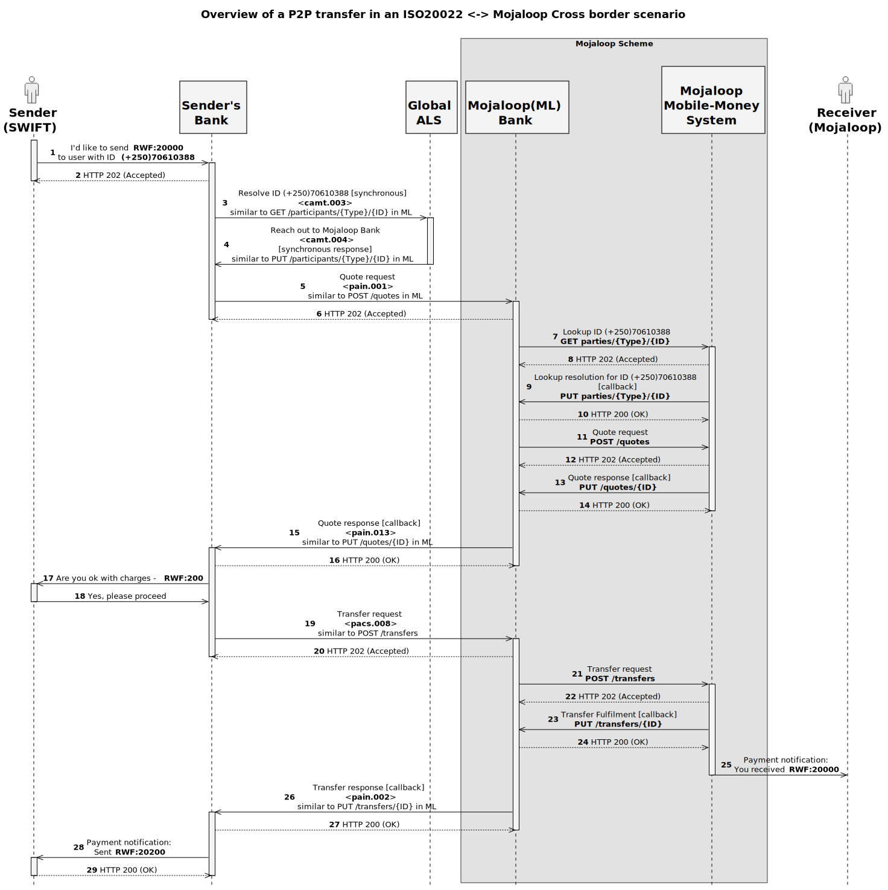

# ml-iso-hackathon

Contents:
- [1. Overview](#1-overview)
- [2. Quick Start](#2-quick-start)
- [3. Developing or running this Demo](#3-developing-or-running-this-demo)
  * [3.1 Components](#31-components)
  * [3.2 Building project](#32-building-project)
  * [3.3 Installing dependencies](#33-installing-dependencies)
  * [3.4 Build](#34-build)
  * [3.5 Running application(s)](#35-running-application(s))
  * [3.6 Linting](#36-inting)
  * [3.7 Tests](#37-tests)
  * [3.8 Checking and updating dependencies](#38-checking-and-updating-dependencies)
  * [3.9 Cleaning build files and dependencies](#39-cleaning-build-files-and-dependencies)
- [4. Deploying](#4-deploying)
- [5. Flow](#5-Flow)
- [6. ISO message schema changes](#6-iso-message-schema-changes)
- [7. Todo](#7-todo)

## 1. Overview

This repo contains "Team Mojaloop's Incredible Submission" for the ISO20022 Hackathon

Go to http://hackathon2.moja-lab.live to see a live demo.


The solution demonstrates a cross-border scenario for peer to peer transfer use-case, from a sender in an ISO20022 based (SWIFT) Scheme to a receiver in a Mojaloop scheme.

## 2. Quick Start

Ensure the following is added to your hosts file"

```hosts
127.0.0.1   hackathon2.moja-lab.live ttk.hackathon2.moja-lab.live ttk-backend.hackathon2.moja-lab.live sim.hackathon2.moja-lab.live gds.hackathon2.moja-lab.live actlog.hackathon2.moja-lab.live senderbank.hackathon2.moja-lab.live mojabank.hackathon2.moja-lab.live
```

```bash
git clone git@github.com:mojaloop/ml-iso-hackathon.git
cd ml-iso-hackathon
docker-compose up

# now go to: [ todo ] in your browser to see it running!
```

## 3. Developing or running this Demo

### 3.1 Components

1. Senders App
2. Senders Bank (ISO (SWIFT) Scheme)
3. Moja Bank (Cross-border adaptation)
4. Moja Mobile Money System (Mojaloop Scheme)
5. Receivers App
6. Mojaloop Testing Toolkit (TTK) caters for #1,#5 and #4 the App UI for both Sender and Receiver apps while also aggregating events / notification messages for visualization using the UI (logs, events, messages)

### 3.2 Building project

This Mono-repo is managed by [Lerna](https://github.com/lerna/lerna), but we have abstracted all Lerna specific commands where possible.

Most standard NPM commands will work normally, except for __install__ command. The usual `build`, `lint`, `start` commands can be run from both the project root and inside each of the module folders. Check the __package.json__ for avaialable scripts.

See more information in the next section.

### 3.3 Installing dependencies

Ensure you run the following command at the project root:

`$ npm install`

This will install:
1. mono-repo tools,
2. run the bootstrap to symbolically link project modules, and
3. run install for each of the project modules

> **NOTE**:<br/>
> Do not run `npm install` directly in a modules folder. This will break the symbolic links created by the mono-repo tools (lerna). <br/><br/>
> Instead, run `npm install` from the project root!<br/><br/>

### 3.4 Build

`$ npm run build`

#### Building a specific module

`$ cd ./modules/<MODULE_NAME>`
`$ npm run build`
`$ npm start`

> **NOTE**:<br/>
> `npm run watch`is supported at root or for each module. <br/><br/>

### 3.5 Running application(s)

#### Start all

`$ npm start`

Note: If run at root, all __executable__ applications will be started.

With debug log level

`$ LOG_LEVEL=debug npm start`

#### Start module

It is also possible to start a specific module:

`$ npm run start:example`

Refer to the main package.json for what applications can be started individually.

### 3.6 Linting

Check for lint errors:
`$ npm run lint`

Auto-Fix lint errors:
`$ npm run lint:fix`

Note: If run at root, all modules will be __linted__.

### 3.7 Tests

Test:
`$ npm run test:unit`

Note: If run at root, all modules will be __tested__.

### 3.8 Checking and updating dependencies

Check for any outdated dependencies:
`$ npm run dep:check`

Update all dependencies to latest versions:
`$ npm run dep:update`

Note: If run at root, all modules __dependencies__ will be either be __checked__ or __updated__.

### 3.9 Cleaning build files and dependencies

Clean all build files:
`$ npm run clean:dist`

Clean all dependencies:
`$ npm run clean:npm`

## 4. Deploying

We deploy the application with `docker-compose` on an AWS ec2 instance.

We use terraform to automate the creation of the instance and required bits and pieces (security groups, dns records etc.).

See [`./infra`](./infra) for more information.

## 5. Flow

The sequence of steps for this cross border scenario is depicated below as a sequence diagram



## 6. ISO message schema changes

While we generally expect to use standard ISO messages, we have made two changes:

1. All the Mojaloop Ids are expected to be UUIDs. We have therefore changed the data types on the ID fields which are exchanged between the two systems to UUIDv4Identifier.
2. As explained here, Mojaloop uses a cryptographic lock using the ILP protocol.
2.1 This allows participants to be confident that the eventual payee has been credited with the funds transferred.
2.2 This cryptographic lock and its key need to be passed back in the appropriate messages to the originating FI (Lake City Bank)
2.3 The form of the lock and key is an encoded version of a 256-bit signature (43 characters.)
2.4 We therefore define the following data types: 
2.4.1 A BinaryString32 simple type which uses a regular expression to specialise the string type.
2.4.2 An ILPData type which contains either a Condition or a Fulfilment, both of whose type is BinaryString32.

Copies of the modified schemas are included in our submission (example messages are provided in **api/example-messages** folder and xsds are in **xsd** folder).

## 7. Todo

- [x] Deploy a landing page, or even just the ttk UI to get started
- [ ] Some circleci config that deploys this project when we push a new tag (is this _really_ necessary?)